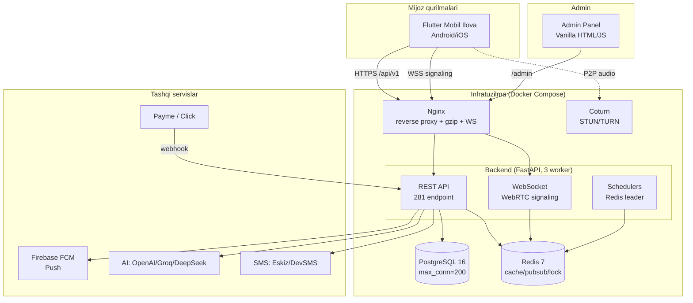
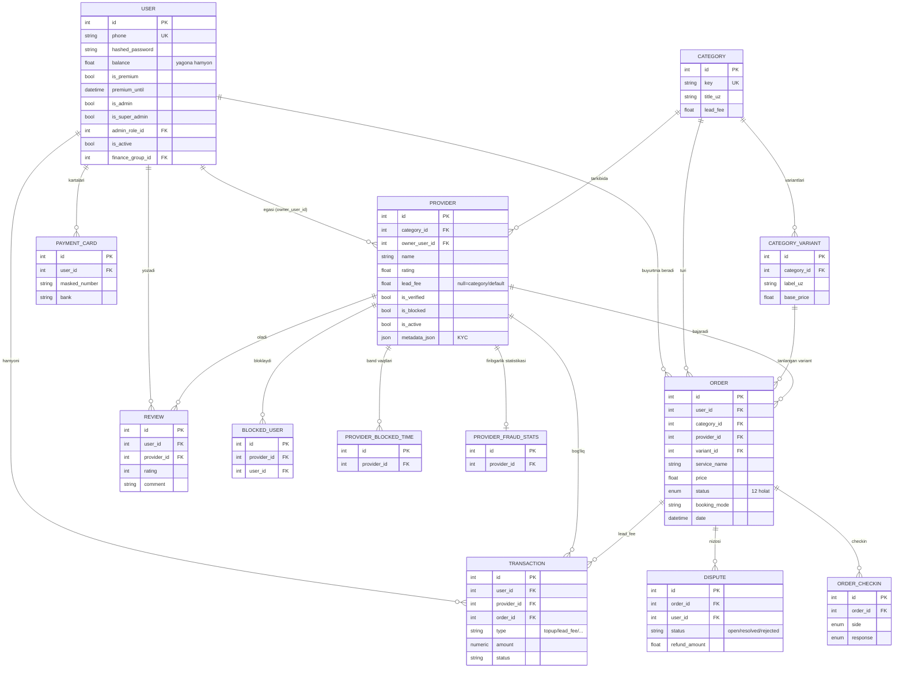
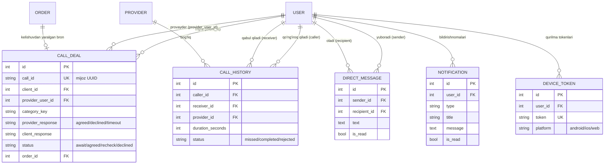
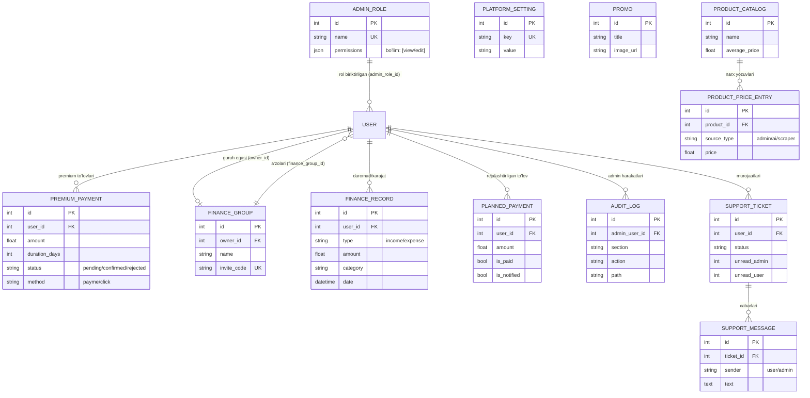
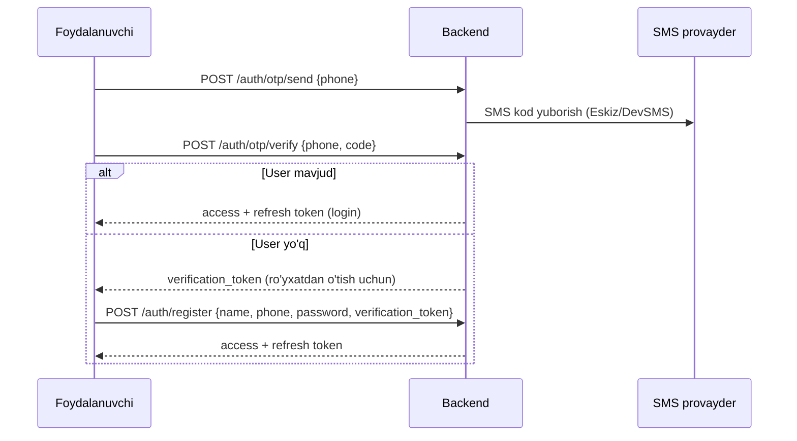
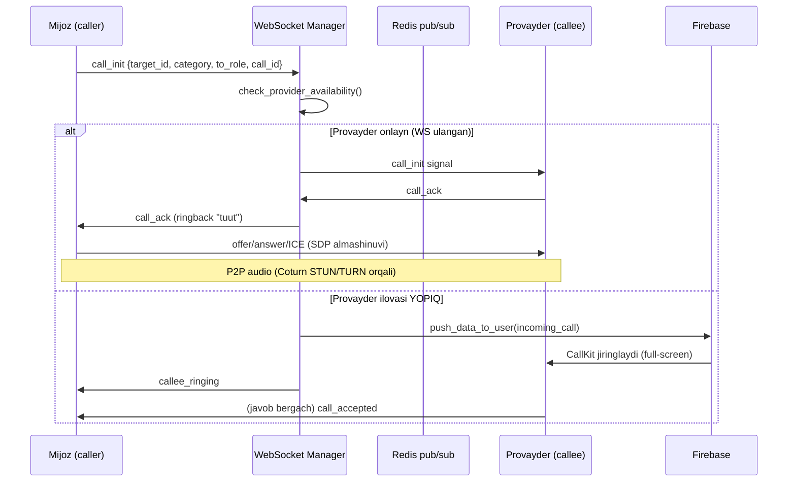
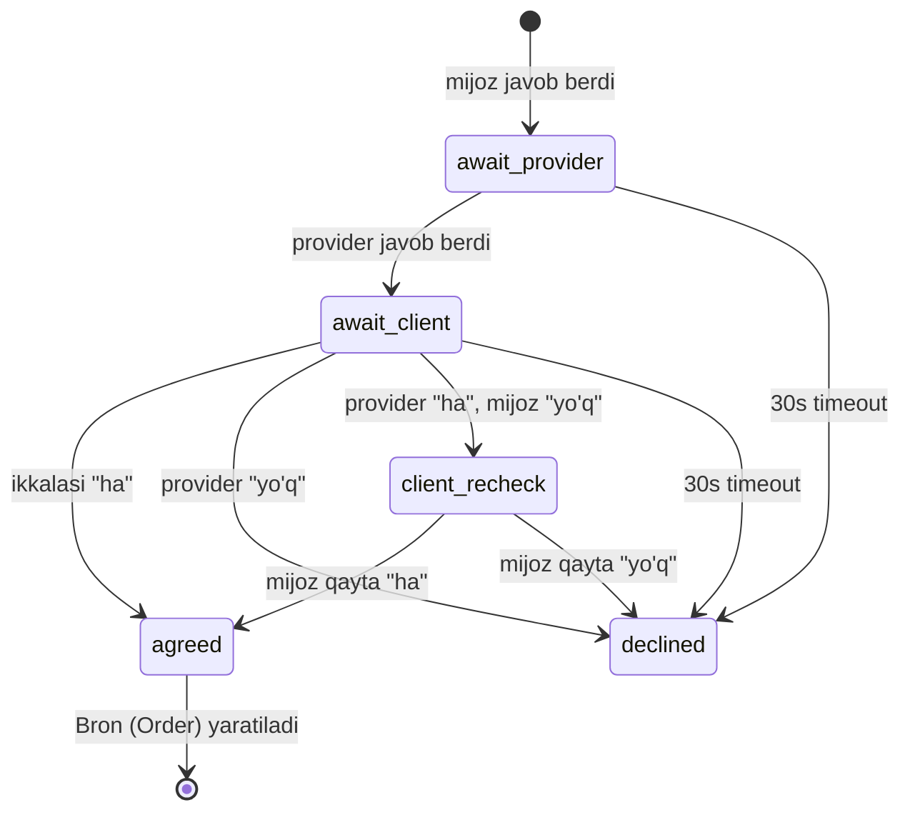
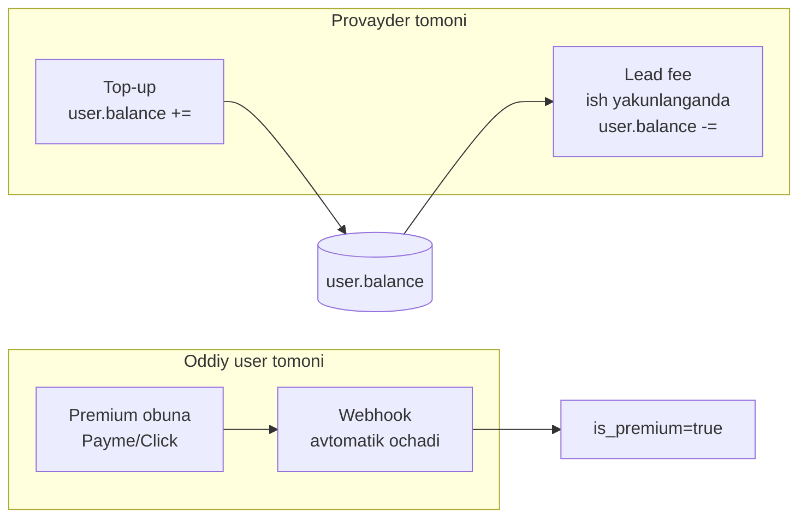
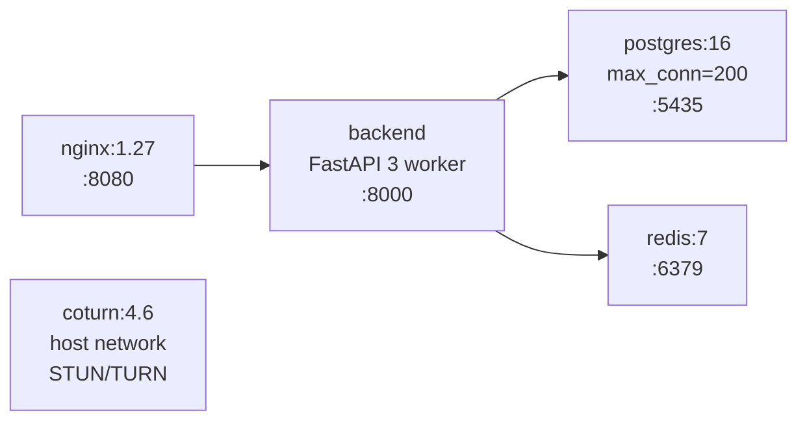
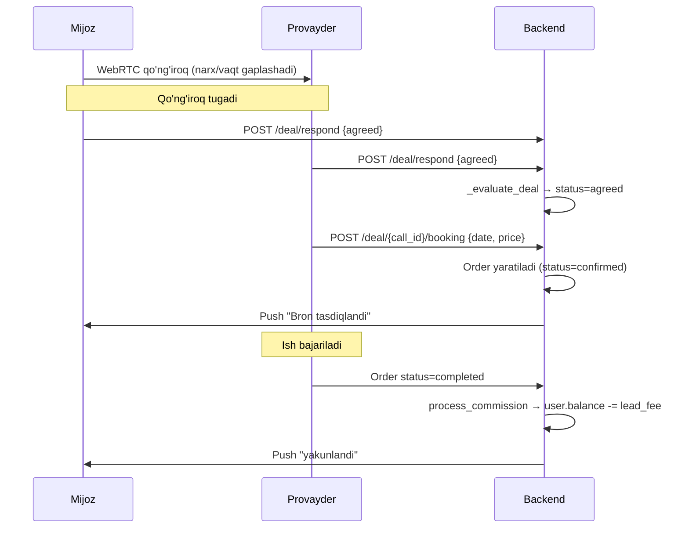

# 🏛️ HubServis — To'liq Arxitektura Hujjati

> **Loyiha:** HubServis (kod nomi `super_app`) — O'zbekiston bozori uchun super-app xizmatlar platformasi
> **Texnologiyalar:** FastAPI (Python) + Flutter (Dart) + Vanilla JS admin panel + PostgreSQL + Redis + WebRTC + Firebase
> **Versiya:** 1.0.9+2017 (Play Store'da)
> **Hujjat sanasi:** 2026-07-22
> **Hajmi:** ~20 600 qator Python (backend), ~76 900 qator Dart (Flutter), 281 API endpoint, 35 DB model

---

## 📑 Mundarija

1. [Umumiy tasavvur (Big Picture)](#1-umumiy-tasavvur)
2. [Tizim arxitekturasi diagrammasi](#2-tizim-arxitekturasi)
3. [Backend arxitekturasi (FastAPI)](#3-backend-arxitekturasi)
4. [Ma'lumotlar bazasi (modellar)](#4-malumotlar-bazasi)
5. [Autentifikatsiya va xavfsizlik](#5-autentifikatsiya-va-xavfsizlik)
6. [Real-time: WebRTC qo'ng'iroqlar va bitim oqimi](#6-real-time-webrtc)
7. [Moliya modeli](#7-moliya-modeli)
8. [AI integratsiya](#8-ai-integratsiya)
9. [Bildirishnomalar (Push/FCM)](#9-bildirishnomalar)
10. [Fon jarayonlari (Schedulers)](#10-fon-jarayonlari)
11. [Flutter mobil ilova arxitekturasi](#11-flutter-arxitekturasi)
12. [Admin panel](#12-admin-panel)
13. [Deployment va infratuzilma](#13-deployment)
14. [Asosiy oqimlar (End-to-end)](#14-asosiy-oqimlar)

---

## 1. Umumiy tasavvur

HubServis — bu **ikki tomonli marketplace + shaxsiy productivity super-app**. U ikki katta qismdan iborat:

### A) Xizmatlar marketplace (asosiy biznes)
Mijozlarni **26 ta soha** bo'yicha ustalar (provayderlar) bilan bog'laydi:
sartarosh, salon, santexnik, elektrik, tozalash, avto-yordam, futbol maydon, ta'lim markazi, quruvchi, ishchi, konditsioner, enaga, repetitor, dezinfeksiya, texnika ustasi, kuryer, massaj, hamshira, stomatolog, tadbirlar, bozorchi, oshxona, geym-zona, sport maydon, kompyuter ustasi va boshqalar.

**Biznes modeli:** provayder o'z hisobiga pul soladi → biz unga mijoz topib beramiz → ish yakunlanganda **lead fee** (komissiya) yechamiz. Mijoz-provayder o'rtasidagi to'lovga aralashmaymiz.

### A2) Buyum savdosi (`marketplace` moduli, OLX uslubi)
Foydalanuvchilar bir-biriga BUYUM sotadi: telefon, kompyuter,
elektronika, maishiy texnika, avto, qurilish mollari, kiyim, hayvon,
mebel. Butun oqim AI chatда: AI kerakli maydonlarni ro'yxat qilib
so'raydi, 3-6 rasm oladi, tasdiqdan keyin e'lon chiqadi; xaridorga
esa chatда 2 ustunli kartalar (grid) ko'rsatiladi.

Xizmatlar marketplace'idan farqi: bu yerda provayder, lead fee va bron
YO'Q. Kod `backend/app/services/marketplace/` va
`lib/*/marketplace/` da, `jobs` (ish e'lonlari) dan mustaqil.

Monetizatsiya: e'lon muddatini uzaytirish (premium bepul) va
adminkadan yoqiladigan "e'lon berish premium bilan" rejimi.

### B) Shaxsiy productivity modullari
Har bir foydalanuvchi uchun: 💰 Moliya menejeri (oilaviy byudjet), 📋 Rejalar/planner, 🛒 Aqlli xarid ro'yxati, 🥗 Kaloriya hisoblagich (AI vision), 💪 Fitnes trener (qadam hisoblagich), ⏰ Majburlovchi budilnik, 🤖 AI yordamchi (chat + tool-calling).

### Monetizatsiya
- **Lead fee** — provayderdan (marketplace)
- **Premium obuna** — oddiy foydalanuvchidan (productivity modullarining to'liq funksiyasi uchun)
- **E'lon uzaytirish** — buyum savdosida muddat tugagach (premium bepul uzaytiradi)

---

## 2. Tizim arxitekturasi



### Qatlamli arxitektura (backend)
```
HTTP so'rov
   │
   ▼
[Middleware]  → RequestLogging → SlowAPI (rate limit) → maintenance_gate → security_headers → CORS
   │
   ▼
[API qatlami]  app/api/v1/*.py — routerlar, Pydantic validatsiya, Depends(get_current_user)
   │
   ▼
[Servis qatlami]  app/services/*.py — biznes logika (OrderService, AuthService, ...)
   │
   ▼
[Model qatlami]  app/models/*.py — SQLAlchemy ORM
   │
   ▼
[DB qatlami]  app/db/session.py — async engine + get_db (auto commit/rollback)
   │
   ▼
PostgreSQL
```

---

## 3. Backend arxitekturasi

### 3.1 Kirish nuqtasi — `app/main.py`

`create_app()` funksiyasi FastAPI ilovasini quradi:

**Lifespan (ishga tushish/to'xtash):**
```python
@asynccontextmanager
async def lifespan(app):
    setup_logging()                          # structured logging + request_id
    await run_startup_init()                 # DDL + seed (ko'p workerda faqat bittasi)
    call_sub_task = create_task(call_manager.start_subscriber())  # Redis pub/sub
    if settings.run_schedulers:
        supervisor_task = create_task(scheduler_supervisor())     # fon jarayonlar
    yield
    # tozalash: tasklarni cancel, engine.dispose()
```

**Middleware'lar (tartib bilan):**
1. `RequestLoggingMiddleware` — har so'rovga `X-Request-ID`, davomiylik logi
2. `SlowAPIMiddleware` — Redis asosidagi rate-limiting
3. `maintenance_gate` — texnik xizmat rejimida API'ni 503 bilan yopadi (admin/auth/health/config ochiq qoladi)
4. `security_headers` — CSP, X-Frame-Options, HSTS, X-Content-Type-Options
5. `CORSMiddleware`

**Static va sahifalar:**
- `/` — landing sahifa (`static/landing/index.html`)
- `/admin`, `/admin/login` — admin panel
- `/terms`, `/privacy`, `/delete-account` — ko'p tilli (uz/ru/en) huquqiy sahifalar
- `/uploads` — yuklangan rasmlar
- `/admin-assets`, `/static` — statik fayllar
- `/robots.txt`, `/sitemap.xml`, `/favicon.ico`

### 3.2 DB sessiya qatlami — `app/db/session.py`

**Ikkita engine:**
```python
# ASYNC — asosiy API uchun (asyncpg)
engine = create_async_engine(database_url, pool_size=10, max_overflow=5,
                             pool_pre_ping=True, pool_recycle=1800)
async_session = async_sessionmaker(engine, expire_on_commit=False)

# SYNC — faqat notification/settings uchun (psycopg2), kichik pool (2+3)
sync_engine = create_engine(database_sync_url, pool_size=2, max_overflow=3)
```

**`get_db` dependency** — avtomatik commit/rollback:
```python
async def get_db():
    async with async_session() as session:
        try:
            yield session
            await session.commit()      # endpoint muvaffaqiyatli → commit
        except Exception:
            await session.rollback()    # xato → rollback
            raise
```

> **Muhim naqsh:** endpointlar odatda `db.flush()` ishlatadi, `commit()` esa `get_db` teardown'da bo'ladi. Ba'zi endpointlar ichida `db.commit()` chaqiradi (masalan pul operatsiyalari kafolatlangan bo'lishi uchun).

### 3.3 API qatlami — `app/api/v1/router.py`

Barcha routerlar `api_router` ga yig'iladi va `/api/v1` prefiksi bilan ulanadi. **50+ router**:

| Guruh | Fayl(lar) | Vazifa |
|-------|-----------|--------|
| Auth | `auth.py` | OTP, login, register, refresh |
| User | `users.py` | Profil, kartalar, balans top-up |
| Katalog | `categories.py`, `providers.py` | Kategoriyalar, provayderlar, sharhlar |
| Provider portal | `provider_portal.py` + 20 ta soha porta (`barber_portal.py`, `cleaning_portal.py`, ...) | Har soha uchun dispatch/booking |
| Buyurtma | `orders.py` | Buyurtma CRUD, holat |
| Qo'ng'iroq | `calls.py` | WebRTC signaling, bitim (CallDeal) |
| Moliya | `finance.py`, `premium.py`, `payments_webhook.py` | Byudjet, premium, Payme/Click |
| Productivity | `plans.py`, `todos.py`, `shopping.py`, `fitness.py`, `calories.py`, `alarms.py` | Shaxsiy modullar |
| AI | `ai_chat.py` | AI yordamchi (tool-calling) |
| Boshqa | `notifications.py`, `support.py`, `messages.py`, `disputes.py`, `promos.py`, `checkin.py`, `app_config.py` | Yordamchi |
| Admin | `admin/` (18 modul) | Admin API (RBAC bilan himoyalangan) |

### 3.4 Core — `app/core/`

| Fayl | Vazifa |
|------|--------|
| `config.py` | Pydantic Settings — barcha env o'zgaruvchilar (DB, Redis, JWT, AI kalitlar, TURN, SMS) |
| `security.py` | JWT (access 7 kun, refresh 1 yil), bcrypt parol hashing |
| `limiter.py` | SlowAPI rate limiter (Redis backend) |
| `logging_config.py` | Structured logging + request ID filter |
| `schedulers.py` | 6 ta fon jarayoni + Redis leader saylovi |
| `call_manager.py` | WebSocket menejeri + Redis pub/sub (worker'lararo signal) |
| `redis_client.py` | Redis ulanish |
| `startup.py` | DDL + seed (ko'p workerda faqat bitta) |

---

## 4. Ma'lumotlar bazasi

**PostgreSQL 16**, SQLAlchemy 2.0 (async), Alembic migratsiyalar. 35 ta model. Asosiylari:

### 4.1 User (`users`)
Markaziy model. **Bir odam ham mijoz, ham provayder bo'lishi mumkin.**
```
id, name, surname, phone (unique), hashed_password, avatar_url, telegram_username
balance          — YAGONA hamyon (lead fee shundan, top-up shunga)
cashback         — DEPRECATED (keshbek olib tashlandi)
is_premium, premium_until
is_admin, is_super_admin, admin_role_id  — RBAC
is_active        — bloklangan bo'lsa False
reminder_offset_minutes, finance_group_id
```
16 ta relationship: orders, reviews, transactions, todos, plans, finance_records, shopping_lists, workout_plans, meal_logs, alarms, providers...

### 4.2 Provider (`providers`)
Soha egasining profili. **Bir user bir nechta sohada provayder bo'lishi mumkin** (har soha alohida Provider yozuvi).
```
id, category_id, name, address, phone, lat, lng
rating, review_count, cover_image
metadata_json   — sohaga xos ma'lumot (KYC hujjatlar, verification_status, ...)
is_active, is_paused, is_verified, is_blocked   — moderatsiya holatlari
owner_user_id   — egasi (User)
balance         — DEPRECATED (B-model'da user.balance ishlatiladi)
lead_fee        — provayderga alohida komissiya (null bo'lsa category yoki default)
completed_orders_count, cancelled_orders_count
```

### 4.3 Category (`categories`) + CategoryVariant
```
Category: id, key (unique), title_uz, subtitle_uz, icon, accent_color, lead_fee
CategoryVariant: id, category_id, label_uz, base_price
```

### 4.4 Order (`orders`)
```
id, user_id, category_id, provider_id, variant_id
service_name, service_icon, address, notes, date, price
status (OrderStatus enum), booking_mode (fixed/flexible), created_at
```

**OrderStatus enum (12 holat):**
```
pending → confirmed → on_the_way → arrived → preparing → in_progress
→ delivered → awaiting_confirmation → completed
                                    ↘ cancelled / no_show / disputed
```

### 4.5 CallDeal (`call_deals`) — bitim/kelishuv
Platformadan "aylanib o'tish"ga qarshi asosiy vosita. Qo'ng'iroqdan keyin ikki tomon "kelishdingizmi?" savoliga javob beradi.
```
call_id (unique, mijoz yaratgan UUID)
client_id, provider_user_id  — ikkalasi ham User
provider_response, client_response  — agreed/declined/timeout/None
status  — await_provider/await_client/agreed/client_recheck/declined
order_id  — kelishuv bo'lsa yaratilgan bron
```

### 4.6 Boshqa muhim modellar
- **Transaction** — pul aylanmasi (topup, lead_fee, premium_subscription, admin_withdraw, topup_bonus)
- **PremiumPayment** — premium to'lov yozuvlari (pending/confirmed/rejected, method: payme/click)
- **Review** — sharhlar (rating, comment)
- **Dispute** — nizolar (mijoz shikoyati, admin hal qiladi)
- **AdminRole + AuditLog** — RBAC (bo'lim ruxsatlari + audit jurnali)
- **Notification** — bildirishnomalar (30 kun saqlanadi)
- **DeviceToken** — FCM push tokenlar
- **PlatformSetting** — kalit-qiymat sozlamalar (admin paneldan boshqariladi)
- **Productivity:** Plan, Todo, ShoppingList, FinanceRecord, PlannedPayment, FinanceGroup, WorkoutPlan/Log, Exercise, MealLog, NutritionProfile, DailyActivity, Alarm
- **SupportTicket + SupportMessage** — qo'llab-quvvatlash chat
- **ProductCatalog + ProductPriceEntry** — bozor narxlari (scraper)

### 4.7 To'liq ER-diagramma (Entity-Relationship)

Quyida barcha jadvallar va ular orasidagi bog'lanishlar ko'rsatilgan. O'qish qulay bo'lishi uchun 4 mantiqiy guruhga bo'lingan.

**Belgilar:** `PK` = asosiy kalit, `FK` = tashqi kalit, `UK` = unikal. `||--o{` = biriga-ko'p, `||--o|` = biriga-bir(ixtiyoriy), `}o--o{` = ko'pga-ko'p.

#### A) Marketplace yadrosi (User, Provider, Order, Category, pul, sharh)



#### B) Qo'ng'iroqlar, bitim va bildirishnomalar



#### C) Premium, moliya, admin (RBAC), qo'llab-quvvatlash



#### D) Productivity modullari (reja, fitnes, kaloriya, budilnik)

```mermaid
erDiagram
    USER ||--o{ PLAN : "rejalari"
    USER ||--o{ TODO : "vazifalari"
    USER ||--o{ SHOPPING_LIST : "xarid ro'yxatlari"
    USER ||--o{ ALARM : "budilniklari"
    ALARM ||--o{ ALARM_LOG : "jiringlash tarixi"
    USER ||--o{ ALARM_LOG : "budilnik loglari"
    USER ||--o{ WORKOUT_PLAN : "mashg'ulot rejalari"
    USER ||--o{ WORKOUT_LOG : "mashg'ulot loglari"
    WORKOUT_PLAN ||--o{ WORKOUT_LOG : "reja loglari"
    USER ||--o| NUTRITION_PROFILE : "ovqatlanish profili"
    USER ||--o{ MEAL_LOG : "ovqat loglari"
    USER ||--o{ DAILY_ACTIVITY : "kunlik faollik (qadam)"

    PLAN {
        int id PK
        int user_id FK
        string title
        datetime due_date
        bool is_completed
        bool is_notified
    }
    TODO {
        int id PK
        int user_id FK
        string title
        bool is_completed
    }
    SHOPPING_LIST {
        int id PK
        int user_id FK
        json items
        float total_estimated_price
    }
    ALARM {
        int id PK
        int user_id FK
        int hour
        int minute
        string mission_type "math/qr/..."
        bool is_enabled
    }
    ALARM_LOG {
        int id PK
        int alarm_id FK
        int user_id FK
        datetime fired_at
        int snooze_count
    }
    WORKOUT_PLAN {
        int id PK
        int user_id FK
    }
    WORKOUT_LOG {
        int id PK
        int user_id FK
        int plan_id FK
    }
    NUTRITION_PROFILE {
        int id PK
        int user_id FK-UK
        string sex
        int age
        float weight_kg
        string goal "lose/maintain/gain"
    }
    MEAL_LOG {
        int id PK
        int user_id FK
        string meal_type "breakfast/lunch/dinner/snack"
        string dish_name
        float calories
        float ai_confidence
    }
    DAILY_ACTIVITY {
        int id PK
        int user_id FK
        date date
        int steps
        float calories
    }
    EXERCISE {
        int id PK
        string external_id UK
        string name_uz
        string body_part
        string equipment
    }
```

**Diagramma xulosasi:**
- **`USER`** — markaziy jadval, deyarli hamma narsa unga bog'lanadi (16+ relationship)
- **`ORDER`** — marketplace yuragi: User + Provider + Category ni bog'laydi, undan Transaction/Dispute/Checkin kelib chiqadi
- **`CALL_DEAL`** — User (mijoz) ↔ User (provayder) bitim, Order ga aylanadi
- **`EXERCISE`** — yagona "mustaqil" jadval (foydalanuvchiga bog'lanmagan, umumiy katalog)
- Ko'p jadvallarda `ondelete=CASCADE` — foydalanuvchi o'chirilsa uning ma'lumotlari ham o'chadi (GDPR/akkaunt o'chirish uchun)

---

## 5. Autentifikatsiya va xavfsizlik

### 5.1 Auth oqimi (SMS OTP asosida)


**Muhim nuqtalar:**
- `AuthService.register` — `registration_open=false` bo'lsa 403 (admin yopishi mumkin)
- Admin foydalanuvchilar OTP'siz, parol bilan kiradi (`is_admin` yoki `admin` maxsus login)
- OTP whitelist raqamlari test uchun `111111` kodini qabul qiladi
- Token: **access 7 kun** (`access_token_expire_minutes=10080`), **refresh 1 yil**

### 5.2 JWT — `app/core/security.py`
`create_access_token(user.id)` / `create_refresh_token(user.id)` → payload `{sub, type, exp}`. `get_current_user` dependency tokenni tekshiradi, `is_active` ni tekshiradi (bloklanган → 403).

### 5.3 RBAC (admin) — `app/api/v1/admin/permissions.py`
- **super_admin** — barcha ruxsat
- **oddiy admin** — `AdminRole` orqali bo'lim (users/orders/finance/...) darajasida `view`/`edit` ruxsat
- `section_guard(section)` — router dependency: ruxsatni tekshiradi + **audit jurnali** (faqat muvaffaqiyatli edit operatsiyalari, mustaqil sessiyada, yield-dependency)

### 5.4 Xavfsizlik choralari
- Rate limiting (SlowAPI + Redis)
- CSP, HSTS, X-Frame-Options, Referrer-Policy header'lar
- Token'lar Flutter'da **shifrlangan xotirada** (Keychain/Keystore) saqlanadi
- Webhook imzolari (Payme key, Click secret) faqat serverda
- CORS sozlanadigan

---

## 6. Real-time WebRTC

### 6.1 Signaling arxitekturasi

Qo'ng'iroqlar **WebRTC** (P2P audio) orqali. Signaling **WebSocket** (`/api/v1/calls/ws?token=...`) orqali:



**`CallManager` (call_manager.py)** — ko'p workerni qo'llab-quvvatlaydi:
- Har worker lokal socketlarni `active_connections` da ushlaydi
- Onlayn userlar Redis `call_online_users` to'plamida
- Target lokal bo'lsa → to'g'ridan yuboradi (tez yo'l)
- Boshqa workerda bo'lsa → Redis kanaliga publish qiladi, o'sha worker yetkazadi
- Redis yo'q bo'lsa → lokal rejim (bitta worker)

### 6.2 Bitim (CallDeal) oqimi — aylanib o'tishga qarshi

Qo'ng'iroq tugagach, ikkala tomon "kelishdingizmi?" savoliga javob beradi:



**Nizolar ATAYIN asimmetrik** (`_evaluate_deal`):
- provider="ha", mijoz="yo'q" → `client_recheck` (mijozdan **qayta** so'raladi — bypass himoyasi)
- provider="yo'q", mijoz="ha" → `declined` (provider hal qiladi)
- **30 soniya qoidasi:** bir tomon javob bermasa → avto-`declined` (`DEAL_AUTO_DECLINE_SECONDS=30`)

Kelishuv `agreed` bo'lsa → provayder `POST /deal/{call_id}/booking` bilan **bron (Order)** yaratadi.

### 6.3 Flutter tomoni
- `flutter_webrtc` — audio stream
- `flutter_callkit_incoming` — tizim darajasidagi qo'ng'iroq UI (jiringlash, full-screen)
- `wakelock_plus`, `flutter_ringtone_player` — ekran/ovoz
- Zakaz qo'ng'irog'i (to_role=provider) → ilova **majburan** provider paneliga o'tadi (`switchToProvider`)

---

## 7. Moliya modeli

> Batafsil: `MOLIYA.md`. Bu yerda qisqacha.

**B-model: yagona hamyon `user.balance`.**



**Asosiy qoidalar:**
1. **Lead fee** — ish `completed` bo'lganda `OrderService.process_commission` orqali `user.balance` (owner) dan yechiladi. **Idempotent** (bir order = bir marta). Miqdor: `provider.lead_fee → category.lead_fee → default_lead_fee` (5000).
2. **Premium** — faqat Payme/Click orqali. Webhook (`payments_webhook.py`) avtomatik ochadi. **Balansdan yechilmaydi, admin tasdiqlamaydi.**
3. **Mijoz↔provayder to'loviga aralashmaymiz.** Keshbek yo'q.
4. **Admin** faqat provayder KYC (ro'yxatdan o'tish) ni tasdiqlaydi.

**Tranzaksiya turlari:** `topup`, `lead_fee`, `premium_subscription`, `admin_withdraw`, `topup_bonus`.

---

## 8. AI integratsiya

### 8.1 Provayderlar
Uch AI provayder (hammasi OpenAI-mos `/chat/completions` formatida):
- **OpenAI** (gpt-4o, gpt-4o-mini) — eng aqlli vision
- **Groq** (llama3/llama-4-scout) — tez, arzon
- **DeepSeek** — matn/chat

Admin paneldan har feature uchun (`vision`/`chat`/`translate`) provayder+model tanlash (`settings_service.resolve_ai`).

### 8.2 AI Chat agent — `ai_agent.py` + `ai_chat.py`
**Tool-calling** arxitekturasi. `SYSTEM_PROMPT` + `TOOLS` sxemasi. Foydalanuvchi tabiiy tilda yozadi, AI mos tool'ni chaqiradi:
- `add_plan` — reja qo'shish
- `add_finance_record` — daromad/xarajat
- `add_shopping_item` — bozorlik ro'yxati
- `set_alarm` — budilnik
- `search_providers` + `create_booking` — xizmat bron qilish

Misol: "ertaga soat 10 da majlis" → AI `add_plan` ni chaqiradi → DB'ga yoziladi.

### 8.3 AI Vision — `vision_service.py`
Ovqat rasmini tahlil qilib **kaloriya/BJU** hisoblaydi (kaloriya moduli uchun). OpenAI gpt-4o yoki Groq llama-4-scout.

### 8.4 Boshqa
- **Fitnes mashqlar tarjimasi** (translate feature)
- **AI moliya maslahatchi** (scheduler'da avtomatik — xarajat tahlili)

---

## 9. Bildirishnomalar

**`NotificationService`** (sync session ishlatadi) — ikki qismli:
1. **DB yozuvi** (`notifications` jadvali, ilovada ko'rinadi)
2. **FCM push** (`fcm_service.py` → Firebase, ilova yopiq bo'lsa ham keladi)

```python
send_notification(user_id, ntype, title, message):
    # 1. DB'ga yozadi (sync_session)
    # 2. _push_to_user → FCM (barcha device_token'larga)
    #    yaroqsiz tokenlarni tozalaydi
```

**`push_data_to_user`** — ma'lumotli push (qo'ng'iroq uchun `incoming_call` data → CallKit).

Yordamchi metodlar: `notify_order_status`, `notify_new_order_for_provider`, `notify_order_shifted`, `notify_booking_time_arrived`.

> **Muhim:** sync + tarmoq operatsiyasi bo'lgani uchun async endpointlarda `asyncio.to_thread(...)` bilan chaqiriladi (event loop bloklanmasligi uchun).

---

## 10. Fon jarayonlari

**`scheduler_supervisor`** — Redis leader saylovi bilan ko'p workerda FAQAT bittasi ishlaydi (`scheduler_leader` kaliti, 60s TTL). 6 ta scheduler:

| Scheduler | Davr | Vazifa |
|-----------|------|--------|
| `plan_reminder_scheduler` | 15s | Reja eslatmalari (offset bilan) |
| `finance_reminder_scheduler` | 30s | To'lov eslatmalari + AI moliya maslahati |
| `checkin_scheduler` | 15s | Buyurtma checkin + auto no-show |
| `order_completion_scheduler` | 5 daq | Ikki tomonlama tasdiq eslatmasi + avto-yakunlash (24 soat) |
| `market_scraper_scheduler` | haftalik (Dushanba 03:00) | Bozor narxlarini yangilash |
| `retention_scheduler` | 24 soat | Eski bildirishnoma/xabarlarni tozalash (>30 kun) |

---

## 11. Flutter arxitekturasi

### 11.1 Kirish nuqtasi — `main.dart`
`main()` da ketma-ket initsializatsiya:
```
NotificationHelper().init()        — lokal bildirishnomalar
CallHistoryService().init()        — qo'ng'iroq tarixi
MealReminderService().init()       — ovqat eslatmalari
CallKitService().init()            — tizim qo'ng'iroq UI
FirebaseService().init()           — FCM
FeatureService().load()            — admin yopgan bo'limlar
LocaleController.load()            — til (uz/ru)
runApp(MyApp)
```

**State management:** `MultiProvider` (provider paketi):
- `AuthProvider` — autentifikatsiya holati
- `AppProvider` — asosiy holat (user, orders, notifications, **user↔provider rejim**)
- `SavedPlacesProvider` — saqlangan manzillar

**Qo'ng'iroq callback zanjiri:** CallKit accept/decline → CallService → CallScreen. Sovuq startda (`onAppReady`) kutilayotgan qo'ng'iroq tiklanadi.

### 11.2 Servis qatlami — `lib/services/` (34 fayl)

| Servis | Vazifa |
|--------|--------|
| `api_service.dart` | **Markaziy Dio klient** — barcha so'rovlar, token interceptor (401→auto refresh), shifrlangan token saqlash |
| `call_service.dart` | WebRTC qo'ng'iroq holati, offer/answer/ICE |
| `callkit_service.dart` | Tizim qo'ng'iroq UI (flutter_callkit_incoming) |
| `call_history_service.dart` | Qo'ng'iroq tarixi, bloklangan raqamlar |
| `firebase_service.dart` | FCM push, background handler |
| `notification_helper.dart` | Lokal bildirishnoma, budilnik/ovqat payload |
| `feature_service.dart` | Premium + feature flag holati |
| `connectivity_service.dart` | Internet holati |
| `hub_data_service.dart` | Xizmatlar ma'lumotlari kesh |
| `*_portal_service.dart` (20 ta) | Har soha uchun provider dispatch API |

### 11.3 Ekranlar — `lib/screens/` (189 fayl)
- **auth/** — splash, login, register, auth_gate
- **Asosiy** — main_screen (RootShell), home_screen, all_categories
- **Xizmat booking/dispatch** — har soha uchun (barber_booking, cleaning_dispatch, ...)
- **provider_side/** — 20 ta soha dashboard (provider paneli)
- **provider_registration/** — 4 qadamli ro'yxatdan o'tish (KYC)
- **Productivity** — finance/, fitness/, calorie/, alarm/, planner_hub
- **calls/** — call_screen, call_history, dm_chat, post_call_dialogs
- **premium/** — premium_screen

### 11.4 Dizayn tizimi
**Glassmorphism** — `lib/theme/glass_tokens.dart`, `lib/widgets/glass/`. BackdropFilter blur, shaffof qatlamlar, gradient. `AppTheme.lightTheme/darkTheme`.

### 11.5 Lokalizatsiya
`lib/l10n/` — `translations.dart` (uz/ru), `.tr` extension. `LocaleController` (ChangeNotifier).

### 11.6 Native integratsiyalar
`pedometer` (qadam), `geolocator` (joylashuv), `image_picker`, `speech_to_text`, `mobile_scanner` (QR), `permission_handler`, `flutter_local_notifications`, `wakelock_plus`, `qr_flutter`.

---

## 12. Admin panel

**Vanilla HTML/CSS/JS** (framework yo'q), backend `static/admin/` dan serve qilinadi.

**Struktura:**
- `index.html`, `login.html` — sahifalar
- `js/main.js` — barcha modullarni import qiladi
- `js/api.js` — fetch wrapper, token
- `js/router.js` — SPA routing
- `js/pages/*.js` — har bo'lim (dashboard, users, providers, orders, finance, settings, reports, premium, support, ...)
- `vendor/` — chart.js, lucide

**Backend API** (`app/api/v1/admin/`, RBAC bilan):
dashboard (stats/chart), users (blok/tahrir), providers (KYC tasdiq/blok), orders (nizolar), finance (top-up/hisobot), settings (default_lead_fee/maintenance/registration), rbac (rollar/adminlar/audit), premium, support, reports (CSV export), products (scraper), ai_settings (AI provayder/prompt), analytics.

---

## 13. Deployment

**Docker Compose** (`backend/docker-compose.yml`) — 5 servis:



- **backend** — Dockerfile (python:3.12-slim), `uvicorn --workers 3` (WEB_CONCURRENCY). Volume: uploads, serviceAccountKey.json (FCM)
- **nginx** — reverse proxy, gzip, WebSocket map (`$connection_upgrade`), 20M upload limit
- **coturn** — WebRTC STUN/TURN (host network)
- **Migratsiya:** Alembic (`001_initial`, `002_composite_indexes`, `2bbc..._settings`). Startup'da `run_startup_init` DDL + seed (leader worker)

**Prod domen:** `https://hubservis.uz` (Flutter `AppConfig.apiBaseUrl`).

---

## 14. Asosiy oqimlar

### 14.1 Buyurtma oqimi (bitim orqali)


### 14.2 Premium sotib olish
```
1. Flutter: POST /premium/subscribe {method: payme}
2. Backend: PremiumPayment(pending) + checkout_url qaytaradi
3. User Payme sahifasida to'laydi
4. Payme → POST /api/v1/payments/payme (webhook, JSON-RPC)
5. Backend imzoni tekshiradi → activate_premium (AVTOMATIK)
6. user.is_premium=true, premium_until uzaytiriladi
```

### 14.3 Provayder ro'yxatdan o'tishi
```
1. Flutter: 4 qadamli KYC (provider_registration/)
2. POST /provider/... → Provider(is_active=False, is_verified=False)
3. Admin panel: KYC hujjatlarni ko'radi → tasdiqlaydi
4. is_verified=True, verification_status=verified
5. Provayder endi qo'ng'iroq qabul qila oladi
```

### 14.4 AI yordamchi
```
1. Flutter: POST /ai/chat {message: "bugun oshga 50 ming ketdi"}
2. Backend: AI provayder (Groq/OpenAI) + TOOLS sxemasi
3. AI: add_finance_record(type=expense, amount=50000, category=oziq-ovqat)
4. Backend: tool bajaradi → FinanceRecord DB'ga
5. AI: "Xarajat qo'shildi ✅"
```

---

## Xulosa: Loyihaning kuchli tomonlari

1. **Toza qatlamli arxitektura** — API → Service → Model → DB
2. **Ko'p worker + Redis** — leader saylovi, pub/sub, distributed lock
3. **Aylanib o'tishga qarshi bitim tizimi** (CallDeal) — biznes uchun kritik
4. **WebRTC + FCM gibrid** — ilova ochiq/yopiq holatda ham qo'ng'iroq ishlaydi
5. **Admin paneldan dinamik boshqaruv** — AI provayder, feature flag, lead fee, maintenance — kod o'zgartirmasdan
6. **Xavfsizlik** — JWT, RBAC + audit, rate limit, shifrlangan token, webhook imzo

### Kelajakda yaxshilash mumkin
- Root papkada ko'p bir martalik `patch_*.py`/`fix_*.py` skriptlar — `scripts/` ga ko'chirish yoki o'chirish
- Deprecated ustunlar (cashback, provider.balance) — kelajakda migratsiya bilan olib tashlash
- Top-up hozir real to'lovsiz — Payme/Click ga ulash
- `app.js.backup` — eski admin fayli, o'chirilishi mumkin

---

*Ushbu hujjat loyiha kodini chuqur o'rganish asosida yaratildi. Har bir bo'lim real fayl/funksiya nomlariga asoslanadi.*
