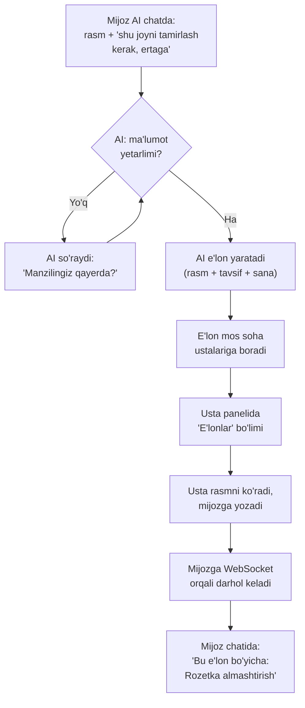

# Reja: AI chat orqali ish e'loni berish

> Tasdiqlash uchun. Kod yozilmagan, faqat reja.

## 1. Siz so'ragan oqim



## 2. Hozir nima bor, nima yo'q

Kodni o'qib chiqdim. Holat:

| Qism | Holat |
|---|---|
| Ish e'lonlari (`job_posts`, `job_offers`) | ✅ Tayyor, prodda |
| Usta panelida "E'lonlar" tabi | ✅ Tayyor |
| Rasm yuklash (`POST /jobs/photo`) | ✅ Tayyor |
| AI agent (modulli, tool'lar bilan) | ✅ Tayyor |
| Vision xizmati (`vision_service.py`) | ✅ Tayyor (kaloriya uchun ishlatilgan) |
| WebSocket manager | ✅ Tayyor (`send_personal_message`) |
| **AI chatga rasm yuborish** | ❌ Yo'q — `ChatMessage.content` faqat matn |
| **AI'da "e'lon ber" tool'i** | ❌ Yo'q |
| **AI yetishmagan ma'lumotni so'rashi** | ❌ Yo'q |
| **DM'ni e'longa bog'lash** | ❌ Yo'q — `DirectMessage` da `job_id` maydoni yo'q |
| **DM'da real-time WebSocket** | ❌ Yo'q — xabar yuborilganda WS ga yuborilmaydi |
| **Chatda "bu e'lon bo'yicha" ko'rsatish** | ❌ Yo'q |

Ya'ni poydevor tayyor, 6 ta bo'shliqni to'ldirish kerak.

## 3. Fayllar tuzilishi

Siz alohida papka so'radingiz. Taklifim:

```
backend/app/services/ai_job/            ← YANGI papka
├── __init__.py
├── conversation.py    # Suhbat holati: nima yig'ildi, nima yetishmaydi
├── extractor.py       # Rasm + matndan ma'lumot ajratish (vision)
├── validator.py       # Yetarlimi? Yetishmasa qaysi savolni berish
└── job_builder.py     # Yig'ilgan ma'lumotdan JobPost yaratish

backend/app/services/ai_agent/
└── job_tools.py       ← YANGI fayl (mavjud uslubga mos, HANDLERS lug'ati)

backend/app/models/
└── ai_job_draft.py    ← YANGI model: tugallanmagan suhbat qoralamasi

tests/
├── test_ai_job_flow.py        ← YANGI: uchdan-uchgacha oqim
└── test_dm_job_context.py     ← YANGI: e'longa bog'langan chat

lib/screens/ai_job/             ← YANGI papka (Flutter)
├── job_draft_sheet.dart        # AI yig'gan ma'lumotni tasdiqlash oynasi
└── job_context_bubble.dart     # "Bu e'lon bo'yicha" ko'rsatkichi
```

## 4. Ish bosqichlari

### 1-bosqich: Chatga rasm yuborish
- `ChatMessage` ga `image_url` maydoni (ixtiyoriy, `content` bilan birga)
- Rasm mavjud `POST /jobs/photo` orqali yuklanadi, chatga URL keladi
- Flutter: chat input'ga kamera/galereya tugmasi (`image_picker` allaqachon bor)
- Vision model chaqiriladi (`groq_vision_model` yoki `openai_vision_model` — sozlangan)

**Tekshiruv:** rasm yuborilganda AI uni ko'rib tavsiflaydi.

### 2-bosqich: AI'da e'lon berish tool'i
`ai_agent/job_tools.py` — mavjud `HANDLERS` uslubida:

| Tool | Vazifasi |
|---|---|
| `start_job_draft` | Suhbatdan e'lon qoralamasini boshlash |
| `update_job_draft` | Yangi ma'lumot qo'shish (manzil, sana, summa) |
| `publish_job` | Qoralamani haqiqiy e'longa aylantirish |

**Muhim qaror:** AI **o'zi e'lon bermaydi**. Avval mijozga to'liq ko'rsatadi ("Rozetka almashtirish, Chilonzor 5, ertaga, 200 000 so'm — to'g'rimi?"), mijoz **tasdiqlagandan keyin** yuboradi. Sababi: AI xato tushunsa, ustalar noto'g'ri e'longa taklif berib vaqt yo'qotadi.

**Tekshiruv:** to'liq ma'lumot berilganda e'lon yaratiladi; yetishmasa AI aniq savol beradi.

### 3-bosqich: Yetishmagan ma'lumotni so'rash
`ai_job/validator.py` — majburiy maydonlar:

| Maydon | Yetishmasa AI so'raydi |
|---|---|
| Soha (kategoriya) | "Bu elektrik ishimi yoki santexnika?" |
| Tavsif | "Muammoni biroz batafsil ayting" |
| Manzil | "Qayerga kelishsin?" |
| Sana | "Qachon kerak?" |
| Summa | Majburiy emas → "Narxni ustalar aytsin" |

**Tekshiruv:** har bir yetishmayotgan maydon uchun to'g'ri savol chiqishi.

### 4-bosqich: Chatni e'longa bog'lash
- `DirectMessage` ga `job_id` maydoni (ixtiyoriy)
- Usta e'lon orqali yozganda `job_id` yuboriladi
- Mijoz chatida "📋 Bu e'lon bo'yicha: Rozetka almashtirish" ko'rsatkichi

**Tekshiruv:** e'lon orqali kelgan xabar oddiy xabardan ajralib turishi.

### 5-bosqich: Real vaqtda yetkazish
- DM yuborilganda `CallManager.send_personal_message` chaqiriladi
- Foydalanuvchi onlayn bo'lsa — darhol ko'radi
- Oflayn bo'lsa — push bildirishnoma (mavjud tizim)

**Tekshiruv:** WebSocket ulangan foydalanuvchi xabarni darhol olishi.

### 6-bosqich: Usta tomoni
Usta panelidagi "E'lonlar" tabi **allaqachon bor**. Qo'shiladi:
- E'lon kartasida rasmni ko'rish (hozir faqat matn)
- "Yozish" tugmasi → chat `job_id` bilan ochiladi
- "Qo'ng'iroq" tugmasi → ilova ichidagi WebRTC qo'ng'irog'i

### 7-bosqich: Xavfsizlik va chegaralar (javoblaringizdan)
- **Haqiqiy telefon raqami berilmaydi:** e'lon oqimida
  `provider_phone` mijozga qaytmaydi. Aloqa faqat ilova ichida.
- **10 ta taklif chegarasi:** 10 taga yetganda yangi taklif `400`
  bilan rad etiladi.
- **Chatda usta ma'lumoti:** ism, yulduzchalar, sharhlar soni va
  profilga o'tish tugmasi.

### 8-bosqich: Ikki tillilik
AI prompti "faqat o'zbekcha" dan "foydalanuvchi tilida" ga
o'zgartiriladi. Foydalanuvchi ruscha yozsa — ruscha javob.

## 5. Sizning javoblaringiz (TASDIQLANDI)

| # | Savol | Javobingiz |
|---|---|---|
| 1 | AI o'zi yuborsinmi? | **Yo'q — tasdiq so'rasin** |
| 2 | Rasmsiz e'lon? | **Ha, bo'ladi** |
| 3 | Usta telefon qila oladimi? | **Ha, lekin ilova ichida WebSocket orqali. HAQIQIY RAQAM BERILMAYDI.** Ilova ichi SMS (chat) ham bor |
| 4 | Taklif soni | **Maksimal 10 ta.** Mijoz chatda taklif bergan ustaning profilini, yulduzchalarini va ma'lumotlarini ko'ra olsin |
| 5 | Til | **O'zbekcha so'rasin. Rus tilida yozsa — ruscha javob bersin (ikki tilli)** |

### Qo'shimcha javoblar (6-8)

| # | Savol | Javobingiz |
|---|---|---|
| 6 | 10 ta taklifdan keyin? | **E'lon ochiq turaveradi**, cheklovsiz murojaat ham mayli |
| 7 | E'lon muddati | **Bitim imzolanmaguncha yoki egasi olib tashlamaguncha, uzog'i 5 kun.** Premium obunachilarga cheksiz |
| 8 | Nechta e'lon | **3 ta.** Premium uchun 20 ta |
| + | Yangi talab | **Admin panelda shu e'lon bo'limi uchun premium yoqish/o'chirish** |

### Bu javoblar kodga qanday tushadi

**6-7-8 uchun premium poydevori TAYYOR:**
- `User.is_premium` va `premium_until` maydonlari bor
- `premium_service.is_premium_active(user)` funksiyasi bor
- Admin panelda premium berish/uzaytirish bor
  (`/api/v1/admin/premium`)
- `settings_service.feature_premium(key)` — bo'lim premium talab
  qiladimi degan sozlama. Sizning "adminkada shu e'lon bo'yicha
  premium yoqish" talabingiz aynan shu namuna bilan qilinadi:
  `feature_jobs_premium` sozlamasi.

**Amaliy qoidalar:**

| Holat | Oddiy foydalanuvchi | Premium |
|---|---|---|
| Bir vaqtda ochiq e'lon | 3 ta | 20 ta |
| E'lon muddati | 5 kun | Cheksiz |
| Taklif soni | Cheklovsiz | Cheklovsiz |

Chegaraga yetganda xato aniq bo'lishi kerak: "Sizda 3 ta ochiq e'lon
bor. Yangi e'lon berish uchun eskisini yoping yoki Premium oling."
(Shunchaki 400 emas — foydalanuvchi nima qilishni bilishi kerak.)

**Taklif soni:** yakuniy qaror — **cheklanmaydi**.

### 9. HUDUD BO'YICHA FILTR (yangi talab)

> "bu elani bir huddagi odamlar yani ustalar kora olishi kerak,
> masalan Toshkent shahardan bo'lsa shuni ichidan"

Hozir usta lentasi **faqat kategoriya** bo'yicha filtrlaydi, ya'ni
Buxorodagi elektrik Toshkentdagi e'lonni ko'radi va bekorga taklif
beradi. Bu tuzatiladi.

**Poydevor tayyor:**
- `JobPost.lat` / `JobPost.lng` — bor (ixtiyoriy)
- `Provider.lat` / `Provider.lng` — bor
- Haversine (masofa) formulasi `ai_agent/provider_tools.py` da
  allaqachon yozilgan — qayta yozilmaydi, ko'chiriladi

**Qanday ishlaydi:**

| Holat | Xatti-harakat |
|---|---|
| E'londa koordinata bor | Ustadan **50 km radius** ichidagilar ko'radi |
| Koordinata yo'q (rasmsiz/matnli e'lon) | Manzil matni bo'yicha shahar solishtiriladi |
| Ikkalasi ham aniq emas | Hamma ko'radi (e'lon yo'qolib qolmasin) |

Radius sozlanadigan bo'ladi (`settings_service`), chunki Toshkent
ichida 50 km ko'p, viloyatlarda esa kam bo'lishi mumkin.

**Tekshiruv:** Toshkentdagi e'lon Buxorodagi ustaga ko'rinmasligi,
lekin Toshkentdagi ustaga ko'rinishi — haqiqiy koordinatalar bilan.

**1. Tasdiq so'rash — namuna allaqachon bor.**
Loyihada `create_booking` aynan shunday ishlaydi: avval `confirm=false`
bilan chaqiriladi, tool xulosa qaytaradi, foydalanuvchi tasdiqlagach
`confirm=true` bilan qayta chaqiriladi. `publish_job` ham shu uslubda
yoziladi, ya'ni yangi mexanizm o'ylab topilmaydi.

**2. Rasmsiz e'lon.**
`JobCreate.photos` allaqachon `default_factory=list`, ya'ni bo'sh
bo'lishi mumkin. Backend o'zgarmaydi.

**3. Haqiqiy raqam berilmaydi.**
Bu MUHIM xavfsizlik qarori. Hozir `JobOffer.to_dict()` da
`provider_phone` maydoni bor va u mijozga qaytadi. Sizning talabingizga
ko'ra **uni e'lon oqimida bermaslik kerak**. Aloqa faqat:
- ilova ichidagi chat (`DirectMessage`)
- ilova ichidagi qo'ng'iroq (`/api/v1/calls/ws` — WebRTC, mavjud)

**4. 10 ta taklif chegarasi + usta ma'lumoti.**
`JobOffer` allaqachon `provider_name`, `provider_rating`,
`provider_review_count` qaytaradi. Chatda ham ko'rsatish uchun shular
ishlatiladi. Chegara `create_offer` da tekshiriladi: 10 ta bo'lsa
yangi taklif rad etiladi (`400`), e'lon "takliflar to'ldi" holatiga
o'tadi.

**5. Ikki tillilik.**
Ilovada `LocaleController` bor (`uz`/`ru`), lekin AI prompti hozir
qat'iy: "Faqat o'zbek tilida javob bering". Uni o'zgartirish kerak:
foydalanuvchi qaysi tilda yozsa, o'sha tilda javob bersin.

---

## 6. Baholash

| Bosqich | Hajm |
|---|---|
| 1. Chatga rasm | O'rtacha |
| 2. AI tool'lari | Katta |
| 3. Savol berish mantig'i | O'rtacha |
| 4. Chatni e'longa bog'lash | Kichik (migratsiya kerak) |
| 5. Real vaqt | Kichik |
| 6. Usta tomoni | Kichik |

Har bosqichdan keyin test yozib, commit qilaman.

## 7. Ehtiyot choralari

- **Baza:** `DirectMessage.job_id` — mavjud jadvalga ustun qo'shish.
  `create_all` buni **qila olmaydi**, shuning uchun `startup.py` dagi
  `ALTER TABLE ... ADD COLUMN IF NOT EXISTS` uslubidan foydalanaman
  (loyihada allaqachon shunday qilingan).
- **Sirlar:** AI kalitlari `.env` da, kodga yozilmaydi.
- **Xarajat:** har rasm vision modelga boradi. Rasm hajmini cheklash kerak
  (`flutter_image_compress` loyihada bor).
- **Tekshiruv:** har bosqich haqiqiy PostgreSQL + HTTP bilan sinaladi,
  hozirgi 169 backend va 146 Flutter testi buzilmasligi tasdiqlanadi.
