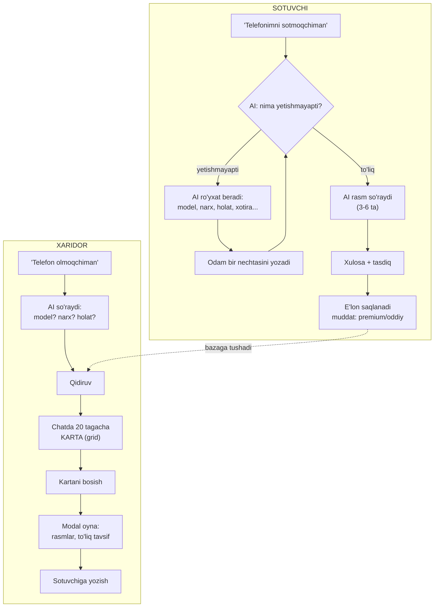

# Reja: AI chat orqali OLX uslubidagi savdo (bozor)

> ✅ **BAJARILDI (2026-08-18).** Bu hujjat ARXIV — qaytadan qilmang.
> Bandma-band hisobot: `docs/qilingan_ishlar/README.md`.
> Kod: `backend/app/services/marketplace/`, `ai_agent/market_tools.py`,
> `lib/{models,screens,widgets}/marketplace/`.
>
> **Sana:** 2026-08-18

---

## 1. Siz so'ragan oqim

Ikki tomon, ikkalasi ham AI chat orqali ishlaydi.



---

## 2. Hozir nima bor, nima yo'q

Kodni o'qib chiqdim.

| Qism | Holat |
|---|---|
| AI agent + 37 tool | ✅ Tayyor |
| Ma'lumot yig'ish uslubi (`ai_job/draft.py`, `validator.py`) | ✅ Tayyor, **namuna sifatida ishlatiladi** |
| Rasm yuklash (`UploadService`) | ✅ Tayyor |
| Chatga rasm yuborish | ✅ Tayyor |
| Adminkada yoqish/o'chirish (`FEATURE_DEFS`) | ✅ Tayyor, bitta qator qo'shiladi |
| Premium tekshiruvi (`premium_service.is_active`) | ✅ Tayyor |
| Chatda tugmalar (`_actionButtons`) | ✅ Tayyor, lekin **faqat tugma** |
| **Mahsulot modeli (e'lon)** | ❌ Yo'q |
| **Bir nechta rasm (3-6 ta)** | ❌ Yo'q — hozir bittadan |
| **Chatda GRID karta** | ❌ Yo'q — hozir vertikal tugmalar |
| **Modal oyna (to'liq ma'lumot)** | ❌ Yo'q |
| **Qidiruv (model/narx/holat)** | ❌ Yo'q |

Ya'ni poydevor kuchli, 6 ta bo'shliq to'ldiriladi.

---

## 3. Fayllar tuzilishi (siz so'ragan alohida papkalar)

```
backend/app/
├── models/
│   └── marketplace/                    ← YANGI papka
│       ├── __init__.py
│       ├── listing.py                  # E'lon (mahsulot)
│       ├── listing_photo.py            # Rasmlar (3-6 ta)
│       └── listing_category.py         # Toifa (telefon, mashina...)
│
├── services/
│   └── marketplace/                    ← YANGI papka
│       ├── __init__.py
│       ├── draft.py                    # Suhbat qoralamasi
│       ├── fields.py                   # Toifa uchun MAYDONLAR ro'yxati
│       ├── validator.py                # Nima yetishmayapti + savol
│       ├── photos.py                   # Rasm qoidalari (3-6 ta)
│       ├── limits.py                   # Muddat/soni: premium va oddiy
│       ├── search.py                   # Xaridor qidiruvi + saralash
│       └── publisher.py                # Qoralama -> haqiqiy e'lon
│
├── services/ai_agent/
│   └── market_tools.py                 ← YANGI: 8 ta tool
│
└── api/v1/
    └── marketplace.py                  ← YANGI: REST endpointlar

lib/
├── models/marketplace/                 ← YANGI papka
│   ├── listing.dart
│   └── listing_filter.dart
│
├── screens/marketplace/                ← YANGI papka
│   ├── listing_detail_screen.dart      # To'liq sahifa
│   ├── my_listings_screen.dart         # "Mening e'lonlarim"
│   └── listing_photos_screen.dart      # Rasmlarni ko'rish
│
├── widgets/marketplace/                ← YANGI papka
│   ├── listing_grid.dart               # Chatdagi GRID (20 tagacha)
│   ├── listing_card.dart               # Bitta karta
│   ├── listing_modal.dart              # Bosilganda MODAL oyna
│   └── photo_carousel.dart             # Rasmlar aylanmasi
│
└── services/
    └── marketplace_service.dart        ← YANGI: API chaqiruvlari

tests/
├── test_marketplace_flow.py            # Sotuvchi oqimi (uchdan-uchgacha)
├── test_marketplace_search.py          # Xaridor qidiruvi
└── test_marketplace_limits.py          # Premium/muddat/adminka

test/
├── marketplace_grid_test.dart          # Grid va karta
└── marketplace_modal_test.dart         # Modal oyna
```

**Nega alohida papka:** `jobs` (ish e'lonlari) allaqachon bor va bu
boshqa narsa. Aralashtirsak, ikkalasi ham chalkashadi. Alohida papka
kelajakda bu bo'limni butunlay o'chirib tashlashni ham osonlashtiradi.

---

## 4. Ma'lumotlar bazasi

### `listings` (e'lon)

| Ustun | Turi | Izoh |
|---|---|---|
| `id` | int | |
| `user_id` | int | Sotuvchi |
| `category_key` | str | `telefon`, `mashina`, `mebel`... |
| `title` | str | "iPhone 13 Pro 256GB" |
| `description` | text | To'liq tavsif |
| `price` | float | Narx |
| `currency` | str | `UZS` / `USD` |
| `condition` | str | `new` / `like_new` / `good` / `used` |
| `attributes` | JSON | Toifaga xos: xotira, rang, yil, probeg |
| `address` | str | Manzil matni |
| `lat` / `lng` | float? | Hudud filtri uchun |
| `status` | enum | `active`, `sold`, `expired`, `hidden` |
| `views` | int | Ko'rilgan soni |
| `expires_at` | datetime | **Premium/oddiyga qarab** |
| `created_at` | datetime | |

### `listing_photos`

| Ustun | Izoh |
|---|---|
| `listing_id` | |
| `url` | Yuklangan rasm |
| `sort_order` | Tartib (birinchisi — asosiy) |

> **Migratsiya:** yangi jadvallar, `create_all` o'zi yaratadi
> (`startup.py`). Mavjud jadvalga tegilmaydi.

---

## 5. Sotuvchi oqimi — bosqichma-bosqich

### 5.1 Toifaga qarab MAYDONLAR (`fields.py`)

Har toifa uchun nima so'ralishi oldindan yozilgan:

| Toifa | Majburiy | Ixtiyoriy |
|---|---|---|
| Telefon | model, narx, holat, xotira | rang, quti/hujjat, kafolat |
| Mashina | model, yil, narx, probeg, holat | rang, karobka, yoqilg'i |
| Mebel | nomi, narx, holat | o'lcham, material |
| Kiyim | nomi, narx, o'lcham, holat | rang, brend |
| Boshqa | nomi, narx, holat | — |

AI **bir vaqtda hammasini** ro'yxat qilib beradi (siz shuni so'radingiz):

> "Yaxshi, telefon sotasiz. Menga quyidagilar kerak:
> • Model (masalan iPhone 13 Pro)
> • Xotira (128/256 GB)
> • Holati (yangi / ideal / yaxshi / ishlatilgan)
> • Narxi
> Bir yozuvda hammasini yozsangiz ham bo'ladi."

Odam qismini yozsa, AI **faqat qolganini** so'raydi.

### 5.2 Rasmlar (`photos.py`)

- **Kamida 3 ta, ko'pi 6 ta** (siz aytgan chegara)
- Yetmasa AI aniq aytadi: "Yana 2 ta rasm kerak (hozir 1 ta)"
- Har rasm mavjud `UploadService` orqali saqlanadi
- Chatdagi rasm oqimi allaqachon bor (yaqinda tuzatilgan)

### 5.3 Tasdiq va saqlash

`publish_job` dagi kabi **ikki qadamli**: avval xulosa, keyin tasdiq.

**Muddat (`limits.py`), adminkadan sozlanadi:**

| | Oddiy | Premium |
|---|---|---|
| E'lon muddati | 7 kun | 30 kun |
| Bir vaqtda e'lon | 5 ta | 50 ta |
| Rasm soni | 6 ta | 10 ta |

---

## 6. Xaridor oqimi

### 6.1 AI savol beradi

> "Telefon olmoqchiman" →
> "Qanday telefon qidiryapsiz? Model, taxminiy narx va holati
> (yangi/ishlatilgan) ni ayting."

### 6.2 Qidiruv (`search.py`)

- Matn bo'yicha (`title`, `description`)
- Narx oralig'i, holat, toifa
- Hudud (koordinata bo'lsa, masofa bo'yicha)
- **Saralash:** yaqinlik → yangilik → narx

### 6.3 Chatda GRID (siz so'ragan asosiy yangilik)

Hozir chatda faqat **vertikal tugmalar** bor. Yangi ko'rinish:

```
┌──────────┬──────────┐
│ [rasm]   │ [rasm]   │
│ iPhone13 │ Redmi 12 │
│ 4 500 000│ 1 800 000│
│ Ideal·2km│ Yaxshi·5km│
├──────────┼──────────┤
│ ...      │ ...      │
```

- 2 ustunli grid, **20 tagacha** karta
- Har kartada: asosiy rasm, nom, narx, holat, masofa
- Yangi action turi: `{"type": "listing_grid", "listings": [...]}`

### 6.4 Modal oyna

Karta bosilganda **modal** ochiladi (yangi ekran emas, siz shunday
so'radingiz):

- Rasmlar aylanmasi (3-6 ta, surib ko'riladi)
- To'liq tavsif va barcha maydonlar
- Narx, holat, joylashuv
- **"Sotuvchiga yozish"** → mavjud chat (`DirectMessage`)
- "Batafsil" → to'liq ekran

> ⚠️ **Telefon raqami berilmaydi.** Loyihaning qat'iy qoidasi: aloqa
> faqat ilova ichida. Bu yerda ham shunday.

---

## 7. AI tool'lari (`market_tools.py`)

| Tool | Vazifasi |
|---|---|
| `start_listing_draft` | Sotuv suhbatini boshlash, maydonlar ro'yxatini berish |
| `update_listing_draft` | Yangi ma'lumot qo'shish, qolganini aytish |
| `add_listing_photos` | Rasm qo'shish, yetarli/yetarsizligini aytish |
| `publish_listing` | Tasdiq bilan e'lon qilish |
| `search_listings` | Xaridor uchun qidiruv → grid |
| `get_listing` | Bitta e'lon to'liq ma'lumoti |
| `my_listings` | "Mening e'lonlarim" |
| `close_listing` | "Sotildi" yoki o'chirish |

Jami: 37 → **45 tool**.

---

## 8. Adminka (siz so'ragan boshqaruv)

`FEATURE_DEFS` ga bitta qator:

```python
("marketplace", "Savdo (e'lonlar)"),
```

Shundan keyin adminkada **avtomatik** paydo bo'ladi:

- ✅ Bo'limni **yoqish/o'chirish** (butun tizim ishlashi)
- ✅ **Premium talab qilish** (e'lon berish pullik bo'lsinmi)
- ✅ Ishlamayotganda ko'rsatiladigan xabar

Qo'shimcha sozlamalar (`settings_service`):

| Kalit | Nima |
|---|---|
| `market_free_days` | Oddiy e'lon muddati (7) |
| `market_premium_days` | Premium muddati (30) |
| `market_free_limit` | Oddiy: bir vaqtda nechta (5) |
| `market_premium_limit` | Premium (50) |
| `market_min_photos` | Kamida rasm (3) |
| `market_max_photos` | Ko'pi (6) |

---

## 9. Siz eslatgan RAG haqida

Siz "rag tizimi bilan ham ishlashim mumkin" dedingiz.

**Mening tavsiyam: birinchi bosqichda RAG shart emas.**

Sabab: RAG (vektor qidiruv) o'xshash ma'noli matnlarni topish uchun
kerak. E'lonlar qidiruvida esa asosiy filtrlar **aniq**: toifa, narx
oralig'i, holat, hudud. Buni oddiy SQL tezroq va arzonroq bajaradi.

**RAG qachon foydali bo'ladi:** e'lonlar soni ko'payib, odamlar
"arzonroq va yaxshi kamerali telefon" kabi noaniq so'rov bersa.
O'shanda `search.py` ichiga qo'shiladi va tashqi qism o'zgarmaydi —
shuning uchun uni alohida modul qilib yozaman.

Xohlasangiz birinchi bosqichdayoq qilaman, ayting.

---

## 10. Ish bosqichlari

| # | Bosqich | Nima bo'ladi | Tekshiruv |
|---|---|---|---|
| 1 | Baza + modellar | `listings`, `listing_photos` | Jadvallar yaratiladi, eski ma'lumot buzilmaydi |
| 2 | Maydonlar + validator | Toifaga qarab savollar | Har toifa uchun to'g'ri ro'yxat |
| 3 | Sotuvchi tool'lari | Qoralama → e'lon | Uchdan-uchgacha: suhbatdan bazagacha |
| 4 | Rasmlar | 3-6 ta chegara | 2 ta bo'lsa rad etadi, 7 ta bo'lsa kesadi |
| 5 | Chegaralar + adminka | Premium/muddat/yoqish | O'chirilganda tool ishlamaydi |
| 6 | Qidiruv | Filtr va saralash | Narx/holat/hudud to'g'ri ishlaydi |
| 7 | Chatda GRID | 20 tagacha karta | Widget testi: 20 karta, rasm, narx |
| 8 | Modal oyna | To'liq ma'lumot | Bosilganda ochiladi, raqam yo'q |
| 9 | Xavfsizlik | Begona e'lonni o'chira olmasligi | Test bilan qo'riqlanadi |

Har bosqichdan keyin test yozib, commit qilaman.

---

## 11. Ehtiyot choralari

- **Telefon raqami berilmaydi** — loyihaning qat'iy qoidasi.
- **Begona e'longa tegib bo'lmaydi** — har amalda `user_id` filtri.
- **Rasm hajmi** — chegaralanadi (`flutter_image_compress` bor).
- **Muddati o'tgan e'lon** — qidiruvda ko'rinmaydi (mavjud
  scheduler'ga qo'shiladi).
- **Adminkadan o'chirilsa** — tool'lar ham, ekranlar ham to'xtaydi.
- **Narx validatsiyasi** — manfiy yoki bo'lmagan qiymat rad etiladi.

---

## 12. Sizning javoblaringiz (TASDIQLANDI)

| # | Savol | Javobingiz |
|---|---|---|
| 1 | Toifalar | **Kengroq ro'yxat** (pastda) |
| 2 | Valyuta | **Ko'rsatish faqat so'mda.** E'lon berishda so'm yoki dollar tanlash mumkin, lekin xaridorga **so'mda konvertatsiya** qilib ko'rsatiladi — chalg'itmasin |
| 3 | "Kelishamiz" | **Ha, bo'lsin** |
| 4 | Muddat tugagach | E'lon qolaveradi. **"Buyurtmalarim" ichida "Mening e'lonlarim"** sahifasi bo'ladi, u yerdan muddatni **uzaytirish (to'lov bilan)**. Premium bepul uzaytiradi |
| 5 | RAG | **Kerak emas.** AI o'zi tushunib, yaxshi filtrlangan so'rov tuzsin |
| 6 | Aloqa | **Haqiqiy raqam YO'Q.** Ilova ichida: WebSocket chat va qo'ng'iroq. E'lon bo'yicha chat ham WebSocket'da |

### 12.1 Toifalar (yakuniy)

| Kalit | Nomi | Maxsus maydonlar |
|---|---|---|
| `telefon` | Telefonlar | model, xotira, holat |
| `kompyuter` | Kompyuter va noutbuk | model, protsessor, RAM, xotira |
| `elektronika` | Elektron jihozlar | tur, model, holat |
| `maishiy` | Maishiy texnika | tur, brend, holat |
| `avto` | Avtomobillar | model, yil, probeg, karobka, yoqilg'i |
| `qurilish` | Qurilish mollari | tur, hajm/o'lcham |
| `kiyim` | Kiyim-kechak | tur, o'lcham, brend |
| `hayvon` | Hayvonlar | turi, yoshi, zoti |
| `mebel` | Mebel | tur, material, o'lcham |
| `boshqa` | Boshqa | — |

Har toifada **umumiy** maydonlar ham bor: nomi, narx, holat, manzil.

### 12.2 Valyuta va konvertatsiya

- E'lon **so'm yoki dollarda** saqlanadi (`price` + `currency`)
- Xaridorga **doim so'mda** ko'rsatiladi
- Dollar bo'lsa: `4 500 000 so'm (350 $)` — asli qavsda
- Kurs mavjud `get_currency` tool'idan olinadi (allaqachon bor),
  kunlik keshlanadi

### 12.3 "Mening e'lonlarim" sahifasi

Joylashuv: **Buyurtmalarim → "Mening e'lonlarim"** tugmasi.

| Holat | Ko'rinishi | Tugma |
|---|---|---|
| Faol | Yashil, qolgan kun soni | "Sotildi", "O'chirish" |
| Muddati tugagan | Kulrang | **"Uzaytirish"** |
| Sotilgan | Belgilangan | "Qayta e'lon" |

**Uzaytirish:** oddiy foydalanuvchi to'laydi (mavjud `payments`
tizimi), premium bepul bosadi.

### 12.4 ⚠️ Firibgarlikdan ogohlantirish (MAJBURIY)

Siz aniq talab qildingiz. Sotuvchi bilan **aloqa boshlanishidan
oldin** ogohlantirish ko'rsatiladi:

> ⚠️ **Ehtiyot bo'ling**
>
> Maklerlar va firibgarlardan saqlaning. Oldindan pul o'tkazmang.
>
> Agar sotuvchi e'londa yozilganidan **boshqa gap aytsa** yoki
> shubhali taklif qilsa — **darhol AI yordamchiga murojaat qiling**.
>
> [Tushunarli] [Shikoyat qilish]

- Chat yoki qo'ng'iroqdan oldin **bir marta** chiqadi
- "Shikoyat qilish" → AI chatga e'lon havolasi bilan o'tadi
- AI shikoyatni qabul qilib, adminkaga yuboradi (mavjud `support`
  tizimi ishlatiladi)

### 12.5 Aloqa — faqat ilova ichida

| Usul | Texnologiya | Holat |
|---|---|---|
| Chat | WebSocket (`DirectMessage` + `call_manager`) | ✅ Bor, e'longa bog'lanadi |
| Qo'ng'iroq | WebRTC (`/calls/ws`) | ✅ Bor |
| SMS/xabar qoldirish | O'sha chat, oflayn bo'lsa push | ✅ Bor |

**Telefon raqami hech qachon berilmaydi** — `to_dict()` da ham,
API javobida ham.

---

## 13. Yangilangan fayllar tuzilishi

Yuqoridagi javoblarga ko'ra qo'shiladi:

```
backend/app/services/marketplace/
├── currency.py          ← YANGI: so'mga konvertatsiya
├── extend.py            ← YANGI: muddatni uzaytirish + to'lov
└── safety.py            ← YANGI: ogohlantirish matni + shikoyat

lib/screens/marketplace/
└── my_listings_screen.dart   # "Mening e'lonlarim" + uzaytirish

lib/widgets/marketplace/
└── safety_warning_dialog.dart ← YANGI: firibgarlik ogohlantirishi
```

---

## 14. Boshlash

Javoblar olindi, savol qolmadi. Bosqichlar 10-bo'limda, ularga
qo'shimcha:

| # | Bosqich |
|---|---|
| 10 | Valyuta konvertatsiyasi (so'mda ko'rsatish) |
| 11 | "Mening e'lonlarim" + muddatni uzaytirish (to'lov bilan) |
| 12 | Firibgarlikdan ogohlantirish + shikoyat oqimi |
