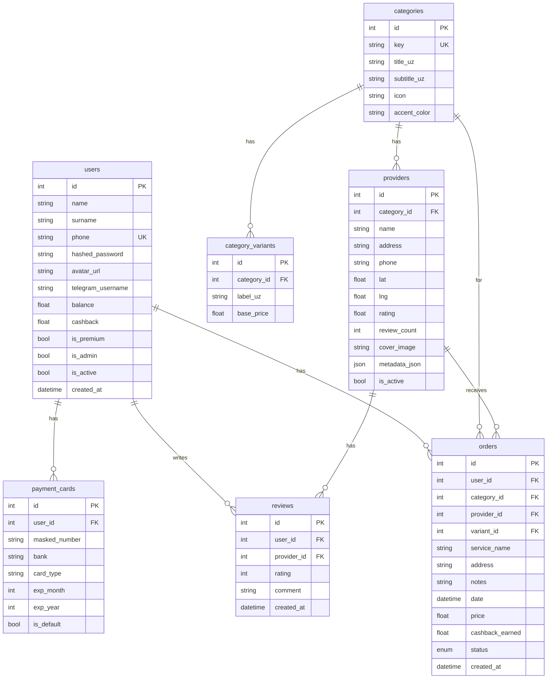

# 🚀 SUPER APP — To'liq Loyiha Tahlili va Ish Rejasi

> **Sana:** 2026-05-19  
> **Loyiha:** Super App — Xizmatlar platformasi (O'zbekiston bozori uchun)  
> **Texnologiyalar:** FastAPI (Backend) + Vanilla HTML/CSS/JS (Admin Panel) + Flutter (Mobil App)

---

## 📁 1. LOYIHA STRUKTURASI

### 1.1 Umumiy Ko'rinish

```
super-app/
├── backend/                    ← FastAPI backend (Python)
│   ├── app/
│   │   ├── api/v1/             ← API endpointlari
│   │   ├── core/               ← Konfiguratsiya, security, limiter
│   │   ├── db/                 ← Database session va base
│   │   ├── models/             ← SQLAlchemy modellari
│   │   ├── schemas/            ← Pydantic schemalar
│   │   ├── services/           ← Biznes logika
│   │   ├── static/admin/       ← Admin panel frontend (HTML/CSS/JS)
│   │   └── main.py             ← FastAPI app yaratish
│   ├── alembic/                ← Database migratsiyalari
│   ├── docker-compose.yml      ← Docker services
│   ├── Dockerfile              ← Backend Docker image
│   ├── requirements.txt        ← Python dependencies
│   └── .env                    ← Environment variables
│
├── lib/                        ← Flutter mobil ilova
│   ├── main.dart               ← Entry point
│   ├── models/                 ← Dart data modellari (16 ta)
│   ├── providers/              ← State management (ChangeNotifier)
│   ├── screens/                ← Ekranlar (20+ booking screens)
│   │   ├── provider_registration/ ← Usta ro'yxatdan o'tish (4 qadam)
│   │   └── provider_side/      ← Usta dashboard (20 ta soha)
│   ├── theme/                  ← App dizayn temasi
│   └── widgets/                ← Qayta ishlatiladigan widgetlar (17 ta)
│
├── pubspec.yaml                ← Flutter dependencies
├── android/                    ← Android konfiguratsiya
├── ios/                        ← iOS konfiguratsiya
└── web/                        ← Flutter web konfiguratsiya
```

---

### 1.2 Backend Strukturasi (Batafsil)

```
backend/app/
├── api/v1/
│   ├── router.py           ← Barcha routerlarni birlashtirish
│   ├── health.py           ← /health endpoint
│   ├── auth.py             ← Ro'yxatdan o'tish, login, refresh token
│   ├── users.py            ← Foydalanuvchi profili, kartalar, balans
│   ├── categories.py       ← Kategoriyalar ro'yxati
│   ├── providers.py        ← Provayderlar, sharhlar
│   ├── orders.py           ← Buyurtmalar CRUD
│   ├── admin.py            ← Admin API (1270 qator, 10 bo'lim)
│   ├── admin_panel.py      ← Admin HTML sahifalarni serve qilish
│   ├── upload.py           ← Avatar/cover rasm yuklash
│   └── notifications.py    ← Bildirishnomalar
│
├── core/
│   ├── config.py           ← Pydantic Settings (env)
│   ├── security.py         ← JWT, bcrypt password hashing
│   ├── limiter.py          ← SlowAPI rate limiter (Redis)
│   └── logging_config.py   ← Structured logging
│
├── db/
│   ├── base.py             ← SQLAlchemy Base class
│   └── session.py          ← Async session, engine
│
├── models/                 ← 6 ta database model
│   ├── user.py             ← Users jadvali
│   ├── category.py         ← Categories + CategoryVariants
│   ├── provider.py         ← Providers (soha egalari)
│   ├── order.py            ← Orders + OrderStatus enum
│   ├── payment.py          ← PaymentCards
│   └── review.py           ← Reviews
│
├── schemas/                ← Request/Response schemalar
│   ├── auth.py             ← Register, Login, Token
│   ├── user.py             ← UserOut, UserUpdate, CardOut
│   ├── category.py         ← CategoryOut, VariantOut
│   ├── provider.py         ← ProviderOut, ReviewOut
│   ├── order.py            ← OrderOut, OrderCreate
│   └── common.py           ← PaginatedResponse, UrlResponse
│
├── services/               ← Biznes logika qatlami
│   ├── auth_service.py     ← Register, Login, Refresh
│   ├── user_service.py     ← Profil, kartalar, balans
│   ├── provider_service.py ← Provayderlar ro'yxati
│   ├── order_service.py    ← Buyurtma yaratish, status
│   ├── upload_service.py   ← Fayl yuklash
│   └── notification_service.py ← In-memory bildirishnomalar
│
└── static/admin/           ← Admin panel frontend
    ├── login.html          ← Login sahifa (17KB)
    ├── login.css           ← Login stillari
    ├── login.js            ← Login logikasi
    ├── index.html          ← Dashboard (130KB)
    ├── dashboard.css       ← Dashboard stillari
    └── dashboard.js        ← Dashboard logikasi (335 qator)
```

---

### 1.3 Database Sxemasi



---

### 1.4 Docker Infratuzilmasi

| Service   | Image              | Port          | Vazifasi                    |
|-----------|---------------------|---------------|-----------------------------|
| **db**    | postgres:16-alpine | 5435 → 5432  | PostgreSQL baza             |
| **redis** | redis:7-alpine     | 6379 → 6379  | Rate limiting, cache        |
| **backend** | custom (Dockerfile) | 8000 → 8000 | FastAPI + Admin panel       |

---

## ✅ 2. QILINGAN ISHLAR (Tayyor)

### 2.1 Backend — Tayyor

| # | Bo'lim | Holati | Tafsilot |
|---|--------|--------|----------|
| 1 | **Auth tizimi** | ✅ Tayyor | Register, Login, Refresh token, JWT, bcrypt |
| 2 | **User profil** | ✅ Tayyor | GET/PATCH /me, balans to'ldirish, kartalar CRUD |
| 3 | **Kategoriyalar API** | ✅ Tayyor | GET ro'yxat, bitta kategoriya, variantlar |
| 4 | **Provayderlar API** | ✅ Tayyor | GET ro'yxat, bitta provayder, sharhlar, review yaratish |
| 5 | **Buyurtmalar API** | ✅ Tayyor | POST yaratish, GET mening buyurtmalarim, status o'zgartirish |
| 6 | **Upload API** | ✅ Tayyor | Avatar va cover rasm yuklash |
| 7 | **Bildirishnomalar** | ✅ Tayyor | GET, mark read, unread count (in-memory) |
| 8 | **Rate limiting** | ✅ Tayyor | SlowAPI + Redis (10/min auth, 50/min admin) |
| 9 | **Logging** | ✅ Tayyor | Structured logging, request ID tracking |
| 10 | **Docker compose** | ✅ Tayyor | PostgreSQL + Redis + Backend |

### 2.2 Admin Panel API — Tayyor (10 bo'lim)

| # | Bo'lim | Holati | Endpointlar |
|---|--------|--------|-------------|
| 1 | **Dashboard** | ✅ | GET /admin/stats, /admin/chart-data |
| 2 | **Foydalanuvchilar** | ✅ | CRUD, block/unblock, premium |
| 3 | **Soha egalari** | ✅ | CRUD, approve/reject, reyting |
| 4 | **Buyurtmalar** | ✅ | Filter, status, delete |
| 5 | **Kategoriyalar** | ✅ | CRUD, variantlar CRUD |
| 6 | **Sharhlar** | ✅ | Moderatsiya, o'chirish |
| 7 | **Moliya** | ✅ | Statistika, komissiya, payout |
| 8 | **Sozlamalar** | ✅ | Komissiya %, cashback, valyuta |
| 9 | **Bildirishnomalar** | ✅ | Push/email/SMS yuborish |
| 10 | **Hisobotlar** | ✅ | Kunlik/oylik/yillik, CSV export |

### 2.3 Admin Panel Frontend — Tayyor (Asosiy)

| # | Xususiyat | Holati | Tafsilot |
|---|-----------|--------|----------|
| 1 | Login sahifa | ✅ | Phone + password, JWT localStorage |
| 2 | Dashboard tab | ✅ | Statistika kartalari, status breakdown |
| 3 | Buyurtmalar tab | ✅ | Jadval, filter (status, kategoriya), pagination, status o'zgartirish |
| 4 | Provayderlar tab | ✅ | Jadval, faollashtirish/o'chirish, yangi qo'shish |
| 5 | Kategoriyalar tab | ✅ | Ro'yxat, variant qo'shish, yangi kategoriya yaratish |

### 2.4 Flutter Mobil Ilova — Tayyor (UI qismi)

| # | Xususiyat | Holati | Tafsilot |
|---|-----------|--------|----------|
| 1 | **Asosiy navigatsiya** | ✅ | BottomNavBar: Asosiy, Qidiruv, Buyurtmalar, Profil |
| 2 | **Home ekran** | ✅ | Header, search bar, xizmatlar grid, promo, banner |
| 3 | **Xizmatlar grid** | ✅ | 20+ xizmat turi (sartarosh, massaj, hamshira, futbol, va boshqa) |
| 4 | **Booking ekranlari** | ✅ | 10+ maxsus booking ekranlari (sartarosh, salon, kuryer, dezinfeksiya, ...) |
| 5 | **Universal booking** | ✅ | Umumiy booking ekran |
| 6 | **Service Hub** | ✅ | Xaritali xizmatlar ko'rish, provayderlar ro'yxati |
| 7 | **Buyurtmalar ekrani** | ✅ | Aktiv va yakunlangan buyurtmalar ro'yxati |
| 8 | **Profil ekrani** | ✅ | Balans, cashback, kartalar, sozlamalar, dark mode |
| 9 | **Provider ro'yxatdan o'tish** | ✅ | 4 qadamli: Onboarding → Kategoriya tanlash → Ma'lumot kiritish → Muvaffaqiyat |
| 10 | **Provider dashboardlar** | ✅ | 20 ta soha uchun alohida dashboard (buyurtmalar, kalendar, hisobot) |
| 11 | **Provider widgetlar** | ✅ | 40 ta widget: har soha uchun calendar + reports |
| 12 | **State management** | ✅ | ChangeNotifier (Provider package) |
| 13 | **Tema** | ✅ | Light + Dark mode |
| 14 | **Demo ma'lumotlar** | ✅ | Barcha modellar ichida demo data |

---

## ⚠️ 3. TOPILGAN XATOLAR VA MUAMMOLAR

### 3.1 Backend Buglar (Tuzatildi ✅)

| # | Bug | Fayl | Holati |
|---|-----|------|--------|
| 1 | `request: Request` parametri yo'q edi (SlowAPI xatosi) | auth.py, admin_panel.py | ✅ Tuzatildi |
| 2 | `AuthService._create_tokens()` mavjud emas | auth.py | ✅ Tuzatildi (`_build_token_response`) |
| 3 | `view_rate_limit` tuple bo'lib keladi, dict emas | main.py middleware | ✅ Tuzatildi (isinstance check) |
| 4 | `users.is_active` ustuni bazada yo'q edi | Database | ✅ Tuzatildi (baza qayta yaratildi) |

### 3.2 Hali Hal Qilinmagan Muammolar

| # | Muammo | Jiddiylik | Tafsilot |
|---|--------|-----------|----------|
| 1 | **Flutter backendga ulanmagan** | 🔴 Kritik | Flutter app hamma narsa demo/hardcoded data bilan ishlaydi, hech qayerda HTTP so'rov yo'q |
| 2 | **Admin sozlamalar bazada saqlanmaydi** | 🟡 O'rta | `DEFAULT_SETTINGS` doimiy o'zgaruvchi, har restart qaytib ketadi |
| 3 | **Bildirishnomalar in-memory** | 🟡 O'rta | Real push/SMS/email integratsiyasi yo'q |
| 4 | **Payout tizimi placeholder** | 🟡 O'rta | Faqat JSON qaytaradi, real to'lov yo'q |
| 5 | **Alembic migratsiyalar buzilgan** | 🟡 O'rta | `script_location` topilmayapti, Docker'da alembic ishlamaydi |
| 6 | **Admin panel 6-10 bo'limlar frontendda yo'q** | 🟡 O'rta | API tayyor, lekin UI faqat 4 ta tab |
| 7 | **Dependencies (get_current_user)** | 🟡 O'rta | Alohida `dependencies.py` fayli mavjud emas (import xatosi bo'lishi mumkin) |
| 8 | **CSV export to'g'ri formatda emas** | 🟢 Past | UTF-8 BOM kerak, haqiqiy CSV format emas |

---

## 📋 4. QILINISHI KERAK BO'LGAN ISHLAR (Ish Rejasi)

### 🔴 Faza 1: KRITIK — Flutter ↔ Backend Integratsiya

Bu eng muhim qadam. Hozir Flutter app butunlay oflayn ishlaydi.

| # | Vazifa | Fayl/Papka | Tavsif |
|---|--------|------------|--------|
| 1.1 | **API Service yaratish** | `lib/services/api_service.dart` | Dio yoki http bilan base URL, token management, interceptor |
| 1.2 | **Auth ekranlar** | `lib/screens/auth/` | Login, Register ekranlar yaratish |
| 1.3 | **Auth Provider** | `lib/providers/auth_provider.dart` | Token saqlash (SharedPreferences), auto-login |
| 1.4 | **AppProvider → API** | `lib/providers/app_provider.dart` | Demo data o'rniga API chaqiruvlar |
| 1.5 | **Kategoriyalar API** | `lib/providers/category_provider.dart` | `/api/v1/categories` dan olish |
| 1.6 | **Buyurtma yaratish** | Booking ekranlar | Demo o'rniga `POST /api/v1/orders` |
| 1.7 | **Buyurtmalar ro'yxati** | OrdersScreen | `GET /api/v1/orders/my` dan olish |
| 1.8 | **Profil API** | ProfileScreen | `GET /users/me`, `PATCH /users/me` |
| 1.9 | **Rasm yuklash** | ProfileScreen | `POST /upload/avatar` integratsiya |
| 1.10 | **Provider ro'yxatdan o'tish** | provider_registration/ | `POST /api/v1/providers` API bilan ulash |

### 🟡 Faza 2: Admin Panel Frontendini To'ldirish

| # | Vazifa | Tafsilot |
|---|--------|----------|
| 2.1 | **Foydalanuvchilar tab** | Jadval, qidirish, block/unblock, premium |
| 2.2 | **Sharhlar tab** | Moderatsiya, o'chirish |
| 2.3 | **Moliya tab** | Statistika, komissiya, payout |
| 2.4 | **Sozlamalar tab** | Komissiya %, cashback, valyuta |
| 2.5 | **Bildirishnomalar tab** | Push/SMS yuborish formi |
| 2.6 | **Hisobotlar tab** | Jadval + CSV yuklab olish |
| 2.7 | **Grafiklar** | Chart.js bilan revenue/orders grafiklari |
| 2.8 | **Responsive dizayn** | Mobil qurilmalarda ham ishlashi |

### 🟡 Faza 3: Backend Yaxshilashlar

| # | Vazifa | Tafsilot |
|---|--------|----------|
| 3.1 | **Alembic tuzatish** | `alembic.ini` ni Docker muhitiga moslashtirish |
| 3.2 | **Settings jadvaliga o'tish** | `platform_settings` jadvali yaratish, in-memory o'rniga |
| 3.3 | **Notification jadvali** | `notifications` jadvali, real saqlash |
| 3.4 | **Transaction jadvaliga** | `transactions` jadvali, to'lovlar tarixi |
| 3.5 | **WebSocket** | Real-time buyurtma statuslari uchun |
| 3.6 | **SMS OTP** | Haqiqiy telefon verifikatsiya (Eskiz.uz yoki PlayMobile) |
| 3.7 | **Firebase Push** | FCM orqali push bildirishnomalar |
| 3.8 | **File storage** | S3/MinIO ga o'tish (hozir local) |
| 3.9 | **dependencies.py yaratish** | `get_current_user` dependency |
| 3.10 | **Testlar** | Pytest bilan unit/integration testlar |

### 🟢 Faza 4: Production Tayyorlash

| # | Vazifa | Tafsilot |
|---|--------|----------|
| 4.1 | **CORS sozlash** | Production uchun aniq originlar |
| 4.2 | **bypass_auth o'chirish** | `.env` da `BYPASS_AUTH=false` |
| 4.3 | **SECRET_KEY yangilash** | Kuchli random kalit |
| 4.4 | **HTTPS** | Nginx + Let's Encrypt |
| 4.5 | **Docker production** | Multi-stage build, gunicorn |
| 4.6 | **CI/CD** | GitHub Actions yoki GitLab CI |
| 4.7 | **Monitoring** | Sentry, Prometheus/Grafana |
| 4.8 | **APK build** | Flutter release APK/AAB |
| 4.9 | **Play Store** | Google Play Console tayyor qilish |
| 4.10 | **Server deploy** | VPS (62.84.182.59) ga deploy |

---

## 🔗 5. QANDAY ULANADI (Arxitektura)

```
┌─────────────────────────────┐
│     Flutter Mobile App       │
│  (Android / iOS / Web)       │
│                              │
│  ┌─────────┐  ┌───────────┐ │
│  │ Provider │  │  Screens  │ │
│  │ (State)  │──│  (UI)     │ │
│  └────┬─────┘  └───────────┘ │
│       │                      │
│  ┌────▼─────────────────┐    │
│  │   API Service (Dio)   │    │
│  │   Base URL: /api/v1   │    │
│  └────┬──────────────────┘    │
└───────┼──────────────────────┘
        │ HTTP/HTTPS
        ▼
┌───────────────────────────────┐
│     FastAPI Backend            │
│     Port: 8000                 │
│                                │
│  ┌──────────┐  ┌────────────┐ │
│  │ API Routes│  │ Admin Panel│ │
│  │ /api/v1/* │  │ /admin/*   │ │
│  └────┬──────┘  └─────┬──────┘ │
│       │               │        │
│  ┌────▼───────────────▼─────┐ │
│  │      Services Layer       │ │
│  │  (Biznes logika)          │ │
│  └────┬──────────────────────┘ │
│       │                        │
│  ┌────▼───────┐  ┌──────────┐ │
│  │ PostgreSQL  │  │  Redis   │ │
│  │ (Data)      │  │ (Cache)  │ │
│  └─────────────┘  └──────────┘ │
└────────────────────────────────┘

┌─────────────────────────────┐
│     Admin Panel (Web)        │
│     /admin/login             │
│     /admin                   │
│                              │
│  Vanilla HTML + CSS + JS     │
│  API: /api/v1/admin/*        │
│  Auth: JWT (localStorage)    │
└─────────────────────────────┘
```

### Ulanish Jarayoni:

1. **Flutter → Backend:** `Dio` HTTP client orqali `/api/v1/*` endpointlariga so'rov yuboradi
2. **Admin Panel → Backend:** `fetch()` API orqali `/api/v1/admin/*` endpointlariga so'rov yuboradi  
3. **Auth flow:** Login → JWT token olish → Har so'rovda `Authorization: Bearer <token>` header
4. **Bazaga yozish:** Backend → SQLAlchemy ORM → PostgreSQL
5. **Rate limiting:** Backend → SlowAPI → Redis

---

## 📊 6. XULOSA — Hozirgi Holat

| Qatlam | Tayyor | Qolgan | Foiz |
|--------|--------|--------|------|
| **Backend API** | Auth, Users, Categories, Providers, Orders, Admin (10 bo'lim), Upload, Notifications | SMS OTP, Push, WebSocket, Settings DB, Transactions | **~75%** |
| **Admin Panel Frontend** | Login, Dashboard, Buyurtmalar, Provayderlar, Kategoriyalar | Users, Sharhlar, Moliya, Sozlamalar, Bildirishnomalar, Hisobotlar, Grafiklar | **~45%** |
| **Flutter App UI** | 20+ ekran, 20 dashboard, 40 widget, navigation, tema | — | **~90%** |
| **Flutter ↔ Backend** | — | API service, auth flow, barcha ekranlar integratsiya | **~0%** |
| **Production** | Docker compose (dev) | HTTPS, CI/CD, monitoring, deploy | **~15%** |

> **Eng katta gap:** Flutter app hech qanday backend bilan bog'lanmagan. Barcha ma'lumot demo/hardcoded. Bu loyihaning eng birinchi va eng muhim vazifasi.

---

## 🎯 7. TAVSIYA ETILGAN KETMA-KETLIK

```
1️⃣  Flutter API Service yaratish (Dio + Token management)
2️⃣  Auth ekranlar (Login/Register) → Backend auth API
3️⃣  Kategoriyalar va Provayderlar backenddan olish
4️⃣  Buyurtma yaratish/ko'rish → Backend orders API
5️⃣  Profil API integratsiya
6️⃣  Admin panel qolgan tablarni to'ldirish
7️⃣  SMS OTP integratsiya (Eskiz.uz)
8️⃣  Push notification (Firebase)
9️⃣  Production deploy (server + HTTPS)
🔟  Play Store publish
```
